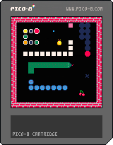

# Python Snake Game

A classic Snake game implemented in Python using Pygame with advanced features and pixel art graphics.



## Features

- Main menu with difficulty selection (Easy, Medium, Hard)
- High score tracking for each difficulty level
- Special food types with different scoring values and visual effects
- Power-ups: speed boost and score multiplier
- Visual effects and animations
- Sound effects and background music
- Texture options for graphics
- Game pause functionality
- Collision detection (walls and self)
- Pixel art (8-bit style) visual appearance

## Pixel Art Features

- Detailed pixel art textures for all game elements
- Directional snake head textures with different animations
- Animated snake body with pixel art patterns
- Multiple food types with distinct pixel art designs:
  - Normal food (apple) with circular pixel art
  - Special food (star) with animated effects
  - Super food (diamond) with shine effects
- Retro-style background with pixel grid pattern
- 8-bit style UI elements including buttons and score displays
- Game over screen with scanlines and pixel art decoration
- Various visual effects like particle animations and pulsing effects

## Project Structure

```
python-snake-game
├── src
│   ├── main.py        # Entry point of the game
│   ├── snake.py       # Contains the Snake class
│   ├── food.py        # Contains the Food class
│   ├── textures.py    # Manages game textures
│   ├── sounds.py      # Manages sound effects and music
│   ├── highscore.py   # Handles high score tracking
│   └── constants.py   # Contains game constants
├── assets
│   ├── images         # Game textures and images
│   └── sounds         # Sound effects and music
├── requirements.txt   # Lists the dependencies
└── README.md          # Project documentation
```

## Requirements

To run this project, you need to have Python and Pygame installed. You can install the required dependencies using the following command:

```
pip install -r requirements.txt
```

## How to Run the Game

1. Clone the repository or download the project files.
2. Navigate to the project directory.
3. Run the game using the following command:

```
python src/main.py
```

## Game Mechanics

- Use the arrow keys to control the direction of the snake.
- The snake grows longer each time it eats food.
- Special food (purple) gives you a speed boost.
- Super food (gold) gives you a score multiplier.
- The game ends if the snake collides with the walls or itself.
- Press P to pause the game.
- Press R to return to the main menu after game over.
- Press S to toggle sound effects.
- Press M to toggle background music.
- Press T to toggle textures.

## Controls

- **Arrow Keys**: Control the snake
- **P**: Pause/Unpause the game
- **R**: Return to main menu after game over
- **S**: Toggle sound effects
- **M**: Toggle background music
- **T**: Toggle textures

Enjoy playing the enhanced Snake game!

## Contributing

Contributions are welcome! If you'd like to contribute to this project, please:

1. Fork the repository
2. Create a new branch (`git checkout -b feature/your-feature`)
3. Make your changes
4. Commit your changes (`git commit -m 'Add some feature'`)
5. Push to the branch (`git push origin feature/your-feature`)
6. Open a Pull Request

## License

This project is licensed under the MIT License - see the [LICENSE](LICENSE) file for details.

## Acknowledgments

- Pixel art inspired by classic 8-bit games
- Sound effects from the 8Bit SFX and Music Pack
- Thanks to the Pygame community for their excellent documentation and examples